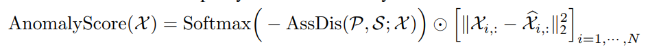
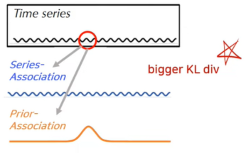
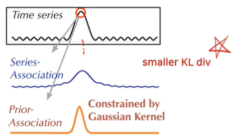

# README

# Welcome

This is pytorch code implementation of [Anomaly Transformer: Time Series Anomaly Detection with Association Discrepancy](https://openreview.net/forum?id=LzQQ89U1qm_) (ICLR, 2022).

# Description About Anomaly Transformer

- Anomaly Transformer utilizes **Prior-Association** and **Series-Association** to discriminate normal and abnormal data points. Prior-Association utilizes gaussian kernel to highlight association between given data point and adjacent data points.  Series-Association utilizes self-attention to obtain association between given data point and all other data points within a sliding window.
- **Association Discrepancy** measures distributational similarity between Prior and series association using KL divergence. The intuition is, normal data points will have ‘smooth’ shaped series association while abnormal data points are more  likely to have ‘pointy’ series association (since abnormal data points are scarce)
- In a nutshell, Anomaly Transformer detects anomalies using Association Discrepancy based anomaly score. **i.e. Any data point with anomaly score larger than the threshold defined as an anomaly.**
    
    
    
    Anomaly score is defined as a multiplication between association discrepancy and reconstruction error.
    

## Examples



Normal



Abnormal

# Environment

### Official Repo Recommendation

- Python 3.6
- Pytorch ≥ 1.4.0

### Docker environment

- [nvcr.io/nvidia/pytorch:20.12-py3](https://catalog.ngc.nvidia.com/orgs/nvidia/containers/pytorch/tags)
- wandb == 0.12.18
- or use dockerfile in ./Docker/ folder

# Get Started

**Seed**: 1998

### 0. Dataset Preprocessing

1. Use [dataset](https://drive.google.com/drive/folders/1gisthCoE-RrKJ0j3KPV7xiibhHWT9qRm) provided in [official paper code implementation repo](https://github.com/thuml/Anomaly-Transformer) 
    - SMAP
    - MLS
    - PSM
    - SMD
    
    Please each dataset in ./data/
    
2. Using custom dataset
    - Anomaly Transformer does not require particular data preprocessing other than sliding window.
    - Therefore, if you wish to make an application using dataset other than ones listed in #1, you should merge all time series instances into one big matrix.
    - For example, if your dataset records daily data in a seperate files, it should be merge into one single format e.g. [days, seq_len, number of variables] → [days * seq_len, number of variables] (though it is completely okay for seq len be different for each daily files)
    - In such case please add necessary codes that merge each data instances into one single matrix. Or simply providing such matrix in a .npy or csv format.

### 1. Load Dataset

```python
train_data_set = anomaly_dataset(
                                    data_dir = Data folder directory,
                                    dataset_name = Name of dataset, 
                                    mode = #['train', 'val', 'test', 'threshold'] 
                                    scaler = scaler, # [standardscaler, minmaxscaler]
                                    window_size = sliding windowsize, # 100 by default  
                                    step_size = step size) # 100 by default
```

- Window size: Official code fixed window size to 100 for all dataset.
- Step_size: 100 for SMD and 1 for the rest of the dataset

```python
train_data_set = anomaly_dataset(
                                    data_dir = './data/SMAP/',
                                    dataset_name = 'SMAP',
                                    mode = 'train', 
                                    scaler = 'StandardScaler',
                                    window_size = 100, 
                                    step_size = 1)
```

### 2. Load model

```python
model = Anomaly_Transformer(
                    window_size = 100, # Sliding window size
                    c_in = dim, c_out = 25, # Input and output dimension i.e. # of variable for each dataset
                    d_model = 512, # Input projection dimension
										n_head = n_head, # Number of attention head
                    num_layers = num_layers, # Number of transformer blocks
										d_ff = 512, # Feed Forward NN hidden dimension
                    dropout = 0.3, 
                    activation = 'relu', # Activation function ['relu', 'gelu']
										norm_type = 'LayerNorm', # ['BatchNorm1d', 'LayerNorm']
                    pos_type = 'encoding', # Positional embedding type ['Learnable', 'encoding']
										emb_type = 'Conv1d', # input projection layer ['Linear', 'Conv1d']
                    device = device, # cuda or cpu 
                    output_attention = True, # return prior, series association result
                    drop_pos = False # True for removing positional embedding layer at all
                    )
```

### 3. Train Model

```python
fit(
	  model = model,
    train_loader = train_loader,
    val_loader = val_loader, 
    optimizer = optimizer, # Adam 
    criterion = criterion, #MSELoss
    scheduler = scheduler, # CosineAnnealingLR
    device = device, 
    Lambda = Lambda, # Minimax loss ratio. 3 by default
    save_dir = savedir, # model checkpoint save directory
    epochs = epochs, # 10 by default.
    temperature = temperature,
    anomaly_ratio = anomaly_ratio, # Anomaly score ratio
    threshold_loader = threshold_loader, # leave it as None if you want to evaluate test set once training is finished
    use_wandb = use_wandb 
  )
```

### 4. Evaluation

```python
criterion_infer = nn.MSELoss(reduce=False)

model_dir = os.path.join(savedir,  checkpoint_name+'.pt')

try:
    model.load_state_dict(torch.load(model_dir)) # Load trained model
except:
    raise NotImplementedError()

model.eval()

with torch.no_grad():
    train_energy = get_energy(model = model, 
                            criterion = criterion_infer, 
                            data_loader = threshold_loader, 
                            device = device,
                            temperature = temperature, 
                            anomaly_ratio = anomaly_ratio,
                            train_energy = None
                            )
    
    threshold = get_energy(model = model, 
                            criterion = criterion_infer, 
                            data_loader = threshold_loader, 
                            device = device,
                            temperature = temperature, 
                            anomaly_ratio = anomaly_ratio,
                            train_energy = train_energy
                            )

    pred, ground_truth= evaluation(
                                loader = test_loader,
                                device = device,
                                criterion = criterion_infer,
                                model = model, 
                                temperature = temperature,
                                threshold = threshold
                                )

accuracy = accuracy_score(ground_truth, pred)
precision, recall, f_score, support = precision_recall_fscore_support(ground_truth, pred,
                                                                    average='binary')
f1_sc = f1_score(ground_truth, pred)
```

- Validation dataset will be used to search optimal threshold
- Test dataset will be used for the final evaluation (which is different from an official repo which used validation dataset for evaluation.)

# Credit

Figure reference 

- [http://dsba.korea.ac.kr/seminar/?mod=document&pageid=1&keyword=anomaly transformer&uid=1936](http://dsba.korea.ac.kr/seminar/?mod=document&pageid=1&keyword=anomaly%20transformer&uid=1936)

Code Reference

- https://github.com/thuml/Anomaly-Transformer

# Experiment Results

Values are derived from average experiment result using three seed (1998, 1105, 1905).  

### Anomaly Transformer
| Dataset | PA | Precision | Recall | F1-Score |
| --- | --- | --- | --- | --- |
| MSL | with_PA | 0.9672 | 0.9672 | 0.9432 |
|  | without_PA | 0.0111 | 0.0111 | 0.0203 |
| SMAP | with_PA | 0.9965 | 0.9965 | 0.9653 |
|  | without_PA | 0.0107 | 0.0107 | 0.0199 |
| SMD | with_PA | 0.9502 | 0.9502 | 0.9238 |
|  | without_PA | 0.0135 | 0.0135 | 0.0241 |

### Random Anomaly Score
| Dataset | PA | Precision | Recall | F1-Score |
| --- | --- | --- | --- | --- |
| MSL | with_PA | 0.8518 | 0.9833 | 0.9214 |
|  | without_PA | 0.0923 | 0.0088 | 0.0160 |
| SMAP | with_PA | 0.8800 | 0.9948 | 0.9611 |
|  | without_PA | 0.1319 | 0.0103 | 0.0191 |
| SMD | with_PA | 0.9149 | 0.6648 | 0.8461 |
|  | without_PA | 0.0411 | 0.0099 | 0.0159 |

* As witnessed in _towards a rigorous evaluation of time-series anomaly detection (Kim et al, 2021),_ Random Anomaly Score reports somewhat lower F1 score in SMD dataset than other datasets as it has shorter average contiguous anomaly segments, which has proven to be one of the most important determining factors of PA-F1 score._

# Citation

```
@inproceedings{
xu2022anomaly,
title={Anomaly Transformer: Time Series Anomaly Detection with Association Discrepancy},
author={Jiehui Xu and Haixu Wu and Jianmin Wang and Mingsheng Long},
booktitle={International Conference on Learning Representations},
year={2022},
url={https://openreview.net/forum?id=LzQQ89U1qm_}
}
```
