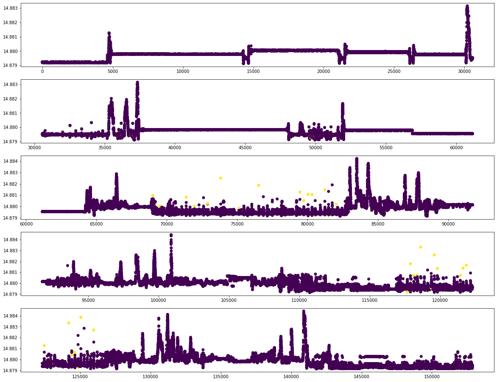

# DAGMM pytorch implementation

### This repo provides elementary pytorch implementation of the following paper.

[[Paper](https://bzong.github.io/doc/iclr18-dagmm.pdf)] Deep Autoencoding Gaussian Mixture Model for Unsupervised Anomaly Detection (ICLR,2018)

**For further multivariate timeseries dataset application, please thoroughly modify related codes in [factory.py](http://factory.py) under dataset folder i.e. ./dataset/factory.py**

## Dataset

[https://www.kaggle.com/code/drscarlat/anomaly-detection-in-multivariate-time-series/input](https://www.kaggle.com/code/drscarlat/anomaly-detection-in-multivariate-time-series/input)

Credit: [Kaggle multivariate time series dataset](https://www.kaggle.com/code/drscarlat/anomaly-detection-in-multivariate-time-series/input)

## Docker enviornment

```bash
nvidia-docker run -it -h [container_name]\
        -p 1905:1905 \
        --ipc=host \
        --name [container_name] \
        -v [Your_Volumee]:/workspace \
        nvcr.io/nvidia/pytorch:20.11-py3 bash
```

## Load Dataset

```python
python save_dataloader.py --yaml_config ./config/save_dataloader.yaml
```

- input_dir and label_dir should be correctly given in save_dataloader.yaml file

## Train

```python
python main.py --yaml_config .config/train.yaml
```

## Evaluation

```python
python test.py --yaml_config .config/test.yaml
```

## Training Details

[Hyperparameters]

SEED: 1998

| Name | Setup |
| --- | --- |
| epochs | 10 |
| lr | 0.0001 |
| lambda1 | 0.001 |
| lambda2 | 0.005 |
- lambda1 and lambda2 related to composition of reconstruction error

# Train Result



- Anomaly score and label scatter plot with time sequence as x-axis.
- Yellow dots are real anomalous points.
- Please refer to [**test.ipynb**](https://github.com/SeungHunHan11/Time-Implementations/blob/master/DAGMM/test.ipynb) for further information
