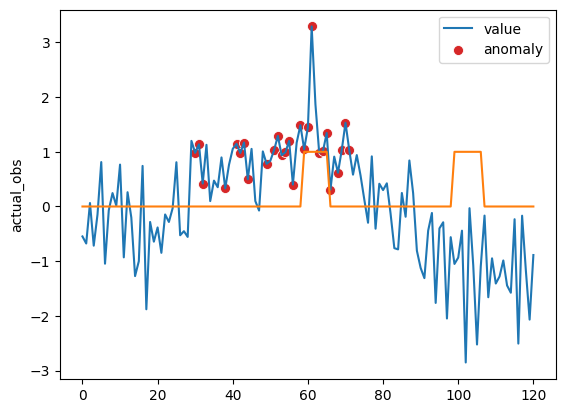

# TAnoGAN pytorch implementation

### This repo provides elementary pytorch implementation of the following paper.

[[Paper](https://arxiv.org/abs/2008.09567)] ****TAnoGAN: Time Series Anomaly Detection with Generative Adversarial Networks**** (SSCI, 2020)

**For further multivariate timeseries dataset application, please thoroughly modify related codes in [make_dataset.py](https://github.com/SeungHunHan11/Time-Implementations/blob/master/TAnoGAN/datasets/make_dataset.py) and relevant files.**

## Dataset

NAB ambient_temperature_system_failure dataset

## Docker enviornment

```bash
nvidia-docker run -it -h [container_name]\
        -p 1905:1905 \
        --ipc=host \
        --name [container_name] \
        -v [Your_Volumee]:/workspace \
        nvcr.io/nvidia/pytorch:22.11-py3 bash
```

## Train

```python
python main.py --yaml_config .config/Train_D_G_w60_step1_hid100.yaml
```

## Evaluation

```python
python test.py --yaml_config .config/Train_D_G_w60_step1_hid100.yaml
#Modify Train_model: True to False for evaluation
```

- [Checkpoint](https://github.com/SeungHunHan11/Time-Implementations/tree/master/TAnoGAN/saved_models/Train_D_G_w60_step1_hid100) for window size = 60, step size = 1, hidden size = 100 is provided as an example
- Refer to [TAnoGAN_sample.ipynb](https://github.com/SeungHunHan11/Time-Implementations/blob/master/TAnoGAN/TAnoGAN_sample.ipynb) file for evaluation result

## Training Details

[Hyperparameters]

SEED: 2

| Name | Setup |
| --- | --- |
| epochs | 20 |
| lr | 0.0002 |
| Iteration | 50 |
| lambda | 0.1 |
- Iteration: Iteration set up for latent vector optimization steps
- Lambda: Anomaly score ratio between reconstruction loss and discrimination loss
    
    i.e. 0.9* reconstruction loss + 0.1* discrimination loss
    

# Evaluation Result



- Red dot indicates a data point that has been labeled as an ‘anomaly’ by TAnoGAN
- Yellow graph shows ground truth (1 for anomalous data point, 0 for normal data point)