# Time Series Anomaly Detection with Machine Learning Models

## Author: Seung Hun Han

## Date: 2023-03-20

The purpose of this notebook is to guide you through the process of TSAD with three different types of machine learning algorithms.

Namely,
### 1. Mean Absolute Deviation

### 2. Isolation Forest

### 3. Local Outlier Factor

Please contant andrewhan@korea.ac.kr for any query.

All comments and feedbacks welcomed :)

We will use 'ambient_temperature_system_failure' data from NAB dataset.

Given dataset contains label in a form of timestamp corresponding to the starting and ending point of observed anomalies.

[['2013-12-15 07:00:00.000000', '2013-12-30 09:00:00.000000'],
 ['2014-03-29 15:00:00.000000', '2014-04-20 22:00:00.000000']]

In the example given above, there had been two sequence of anomalies one of which started at 2013-12-15 07:00:00 and ended at 2013-12-30 09:00:00.
As a result, all data point between anomalous sequence shall be treated as anomalies.


```python
import pandas as pd
import numpy as np
import matplotlib.pyplot as plt
import json
```


```python
df_dir = '/directory/ambient_temperature_system_failure.csv'
label_dir = '/directory/combined_windows.json'
label_name = 'realKnownCause/ambient_temperature_system_failure.csv'
```


```python
def label_anomaly(data_dir , label_dir, label_name): 

    with open(label_dir) as FI:
        j_label = json.load(FI)

    anomaly_label = j_label[label_name]
    anomalous_incidence = len(anomaly_label)
    
    df = pd.read_csv(data_dir)
    df['timestamp'] = pd.to_datetime(df['timestamp'])
    df['anomaly'] = 1
    df['incidence'] = 0
    for idx, incident in enumerate(anomaly_label, start=1):
        df.loc[(df.loc[:,'timestamp']>=incident[0]) & (df.loc[:,'timestamp']<=incident[1]),'anomaly'] = -1
        df.loc[(df.loc[:,'timestamp']>=incident[0]) & (df.loc[:,'timestamp']<=incident[1]),'incidence'] = idx

    return df, anomalous_incidence
```


```python
import matplotlib.pyplot as plt

plt.style.use('ggplot')

def plot_ts(df: pd.DataFrame, anomalous_incidence: int, title: str, method: str = None):

    plt.figure(figsize=(20,10))
    plt.plot(df['timestamp'], 
             df['value'], 
             alpha = 0.8, 
             linewidth = 2,
             color = 'gray',
             label = 'Normal'
             )

    anomaly_label = ''
    for i in range(anomalous_incidence):
        if i ==1:
            anomaly_label ='Ground Truth'
        plt.plot(df.query('anomaly == -1 and incidence == {}'.format(i+1))['timestamp'],
                 df.query('anomaly == -1 and incidence == {}'.format(i+1))['value'], 
                 linewidth = 2,
                 color= 'skyblue',
                 label = anomaly_label 
                 )
        
        plt.text(df.query('anomaly == -1 and incidence == {}'.format(i+1))['timestamp'].median(),
                df.query('anomaly == -1 and incidence == {}'.format(i+1))['value'].max(), 
                f'Incidence {i+1}',
                size = 10
                )
    if method != None:
        plt.scatter(df.query('{}_anomaly == -1'.format(method))['timestamp'],
                 df.query('{}_anomaly == -1'.format(method))['value'], 
                 color ='red',
                 label = 'Predicted Label'
                 )
    
    plt.xticks(rotation = 90)
    plt.title(title, size = 15)
    plt.legend()
```


```python
df, anomalous_incidence = label_anomaly(df_dir, label_dir, label_name)

plot_ts(df, anomalous_incidence, 'ambient_temperature_system_failure Dataset scatter plot')
```


    
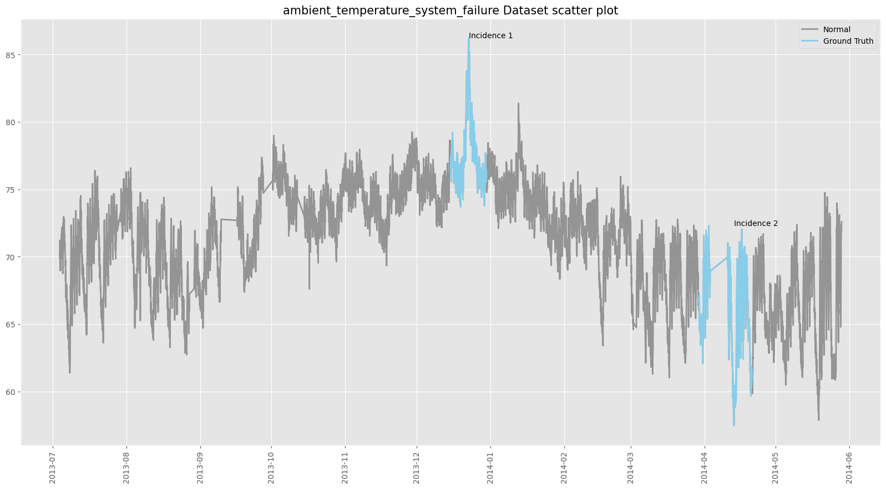
    


Detecting the first anomalous sequence might not be troublesome as its value distinctively increases compared to adjacent sequences.
Nonetheless, the second anomalous sequence does not quite diverge away from the adjacent sequences. Therefore, contexts nearby the anomalous data point should be adequately taken into account, which could possibly make detecting the second anomalous sequence a hard task.

# Yet

Bare in mind that none of machine learning mechanism, which will be introduced in the following steps, takes temporal context into account. As a result, the quality of anomaly detection using three models is bound to be poor.

## 1. Mean Absolute Deviation (MAD)

Selected method labels data points that diveiate 'significantly' away from the center (mean) as anomalies.

Those who are familar with a statistical modelling should have noticed that such method resembles identifying outlier using the formula mu+-1.5 IQR.

As a result, the key assumption of MAD is that the distribution of a sample data should resemble "Normal Distribution"

Ideally, closer the sample distribution is to normal distribution, better the model will detect anomalies.

In reality, not many sample distribution exactly follow normal distribution. Thus, MAD does not guarantee quality result unless normality assumpotion is completely satisfied.


```python
import seaborn as sns

sns.kdeplot(np.array(df['value']), bw=0.5) # Distribution is quite skewed to left. Still, it has distinctive bell-shaped curve.
```

    /tmp/ipykernel_1955/1888462493.py:3: UserWarning: 
    
    The `bw` parameter is deprecated in favor of `bw_method` and `bw_adjust`.
    Setting `bw_method=0.5`, but please see the docs for the new parameters
    and update your code. This will become an error in seaborn v0.13.0.
    
      sns.kdeplot(np.array(df['value']), bw=0.5) # Distribution is quite skewed to left. Still, it has distinctive bell-shaped curve.


    <AxesSubplot: ylabel='Density'>


    
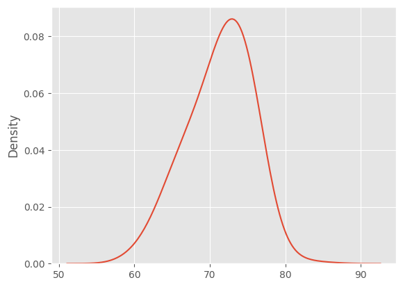
    


```python
x = np.array(df['value'])
```


```python
numerator = 0.6745 * (x-np.median(x))
MAD = np.median(np.abs(x-np.median(x)))
```

To calculate MAD, either use a formula given above or just use a module provided by scipy.

The result is same either way.


```python
from scipy.stats import median_abs_deviation
median_abs_deviation(x), MAD
```


    (2.9369587900000056, 2.9369587900000056)


```python
def compute_MAD(df):
    x = np.array(df['value'])
    numerator = 0.6745 * (x-np.median(x))
    MAD = np.median(np.abs(x-np.median(x)))
    mad_score = numerator/MAD

    return mad_score
```


```python
df_mad = df.copy()
```


```python
df_mad['mad_score']=compute_MAD(df)
```


```python
df_mad['predicted'] = 1
```


```python
df_mad.loc[(df_mad['mad_score']>=3.5) | (df_mad['mad_score']<=-3.5),'predicted'] = -1
```

No data point with ground truth = anomaly has been classified as anomalies.

This is not so much surprising since anomalies in our dataset in general, do not diverge away from the mean as much.

The lesson from this example is that accounting temporal context is paramount in TSAD. 


```python
sns.kdeplot(df_mad['mad_score'])
sns.kdeplot(df_mad.query('anomaly == -1')['mad_score']) # Distribution of mad_score for anomalous data point are distributed closely to the center
```


    <AxesSubplot: xlabel='mad_score', ylabel='Density'>


    
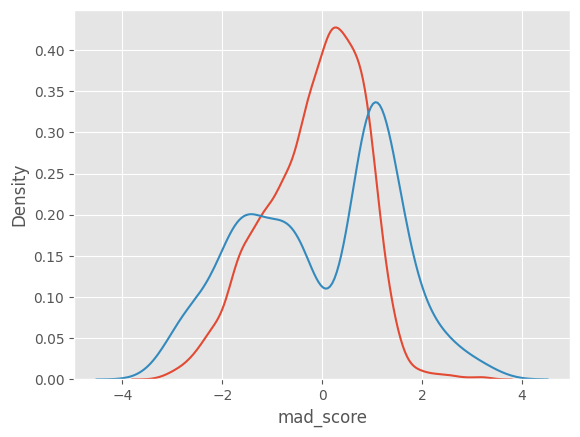
    


```python
from sklearn.metrics import confusion_matrix, ConfusionMatrixDisplay
cm = confusion_matrix(df_mad['anomaly'], df_mad['predicted'], labels=[1, -1])
disp_cm = ConfusionMatrixDisplay(cm, display_labels=[1, -1])
disp_cm.plot();

plt.grid(False)
plt.tight_layout()
plt.title('TSAD for ambient_temperature_system_failure Dataset scatter plot', size = 10)
```


    Text(0.5, 1.0, 'TSAD for ambient_temperature_system_failure Dataset scatter plot')


    
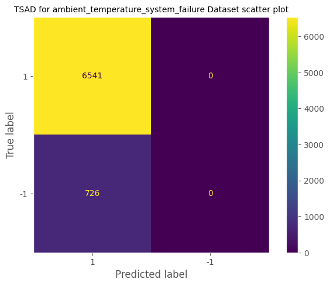
    


## 2. Isolation Forest

As the name indicates, this model is tree-based machine learning algorithm.

As all tree-based models do, Isolation Forest selects an attribute and splits into minimum and maximum section.

For all given data points, Isolation Forests counts attempts required to isolate a data point. 

The intuition is that for an anomalous data point, IF will take small number of attempts for isolation since it will deviates quite far away from other clusters of data points.

### Example of Isolation Forest Normal Data point case
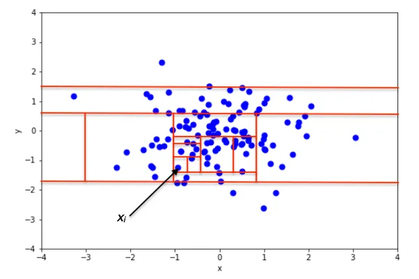

### Example of Isolation Forest Anomalous Data point case
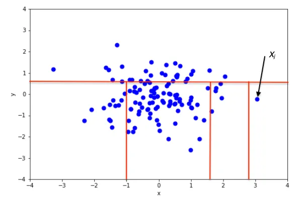

* Anomalous data point takes less attempts to be isolated!

Now, let's get started


```python
train_x = df.loc[:int(len(df))*0.7]
test_x = df.loc[int(len(df))*0.7:]
```


```python
contamination = round(len(df.query('anomaly == -1')) / len(df), 5)
```


```python
from sklearn.ensemble import IsolationForest

iso_forest = IsolationForest(random_state=1105)
iso_forest.fit(df['value'].values.reshape(-1,1))
```


    IsolationForest(random_state=1105)


```python
preds_iso_forest = iso_forest.predict(df['value'].values.reshape(-1,1))
```


```python
cm = confusion_matrix(df['anomaly'], preds_iso_forest, labels=[1, -1])

disp_cm = ConfusionMatrixDisplay(cm, display_labels=[1, -1])

disp_cm.plot();

plt.grid(False)
plt.tight_layout()
```


    
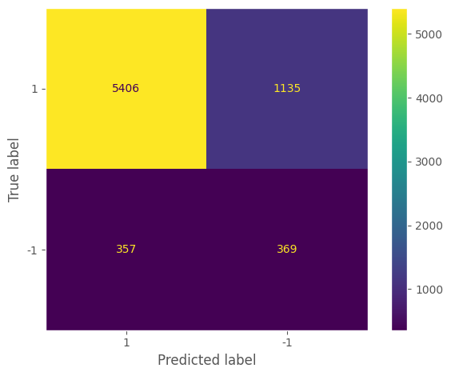
    


```python
df['IF_anomaly'] = preds_iso_forest
plot_ts(df,anomalous_incidence,'Isolation Forest TSAD','IF')
```


    
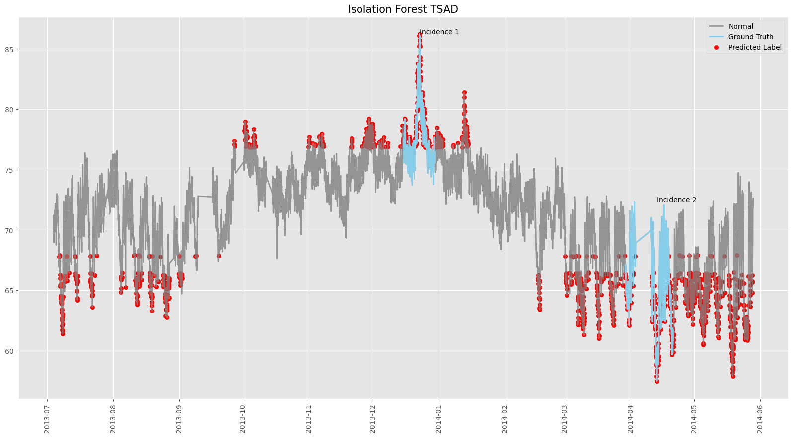
    


```python
from sklearn.metrics import recall_score, f1_score, roc_auc_score, precision_score

def return_metrics(y_true, y_pred):

    recall = recall_score(y_true, y_pred)
    f1 = f1_score(y_true, y_pred)
    roc = roc_auc_score(y_true, y_pred)
    precision = precision_score(y_true, y_pred)

    print(f'Recall:{recall: .4f} F1:{f1: .4f} AUROC:{roc: .4f} Precision:{precision: .4f}')

    return recall, f1, roc, precision


return_metrics(df['anomaly'], preds_iso_forest)
```

    Recall: 0.8265 F1: 0.8787 AUROC: 0.6674 Precision: 0.9381


    (0.8264791316312491, 0.878738621586476, 0.6673717972205832, 0.9380530973451328)


## Implementing Sliding Window

Perhaps treating each time step as an individual data point is not an optimal option.

To partially add temporal context to the model, I will preprocess the data using sliding window.


```python
def roll(df: pd.DataFrame, window_size:int, step_size: int):

    seq_len = (len(df)-window_size)//step_size +1

    window_data = np.zeros((seq_len, window_size))
    window_label = np.zeros((seq_len, ))

    idx = 0
    seq_idx = 0

    while(idx < df['value'].values.shape[0] - window_size + 1):
        window_data[seq_idx] = df['value'].values[idx:idx+window_size]
        window_label[seq_idx] = -1 if df['anomaly'][idx:idx+window_size].sum().item() < 0 else 1
        idx += step_size
        seq_idx +=1
    
    return window_data, window_label

window_data, window_label = roll(df, 60, 1)
```


```python
iso_forest = IsolationForest(random_state=1105)

iso_forest.fit(window_data.mean(axis=1).reshape(-1,1))
```


    IsolationForest(random_state=1105)


```python
preds_iso = iso_forest.predict(window_data.mean(axis=1).reshape(-1,1))

cm = confusion_matrix(window_label, preds_iso, labels=[1, -1])

disp_cm = ConfusionMatrixDisplay(cm, display_labels=[1, -1])

disp_cm.plot();
plt.grid(False)
plt.tight_layout()
```


    
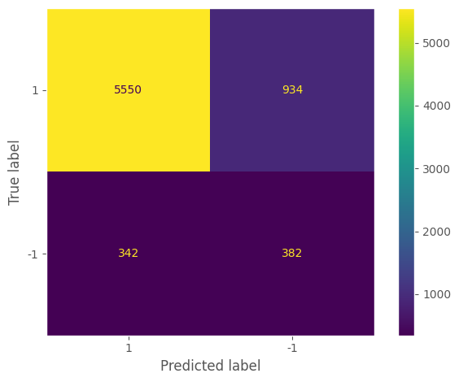
    


```python
return_metrics(window_label, preds_iso)
```

    Recall: 0.8560 F1: 0.8969 AUROC: 0.6918 Precision: 0.9420


    (0.8559531153608884,
     0.8968972204266321,
     0.6917887123765768,
     0.9419551934826884)


Again, the result is very poor. With Isolation Forest, all the data points were predicted as anomalies.

Such false positive is troublesome since in real life as it leads to unnecessary waste of resources.

## 3. Local Outlier Factors (LOF)

LOF seeks for a data point that are not as close to its nearest neighbors.

The intuition is that distance to nearest neighbors for anomalous data points will be relatively bigger than distance to nearest neighbors for nearest neighbors of anomalous data points.

The description given above might be hard to digest. So let's take a look into an example.

### Example of Isolation Forest Anomalous Data point case
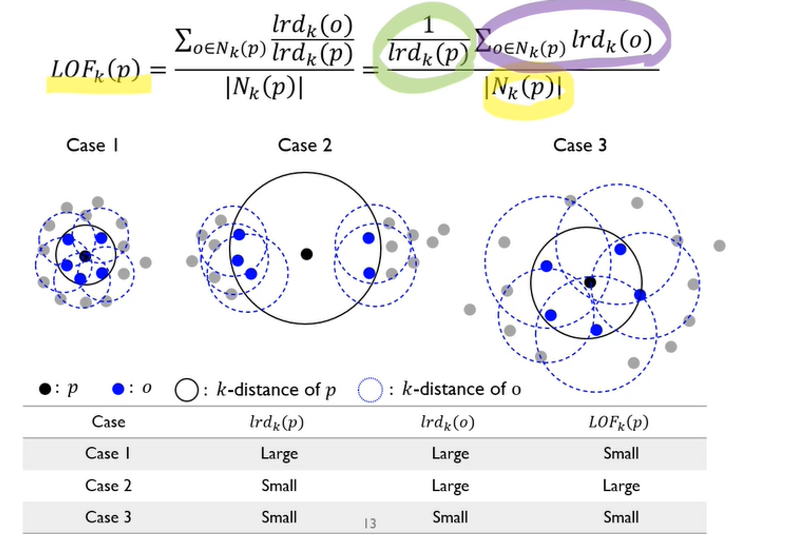

* For an anomalous data point, it is not as close to its nearest neighbors as its neighbors are close to their own nearest neighbors.


```python
from sklearn.neighbors import LocalOutlierFactor

lof = LocalOutlierFactor(n_neighbors=18,contamination=contamination, novelty=True)

lof.fit(df['value'].values.reshape(-1,1))
```


    LocalOutlierFactor(contamination=0.0999, n_neighbors=18, novelty=True)


```python
preds_lof = lof.predict(df['value'].values.reshape(-1,1))

cm = confusion_matrix(df['anomaly'], preds_lof, labels=[1, -1])

disp_cm = ConfusionMatrixDisplay(cm, display_labels=[1, -1])

disp_cm.plot();
plt.grid(False)
plt.tight_layout()
```


    
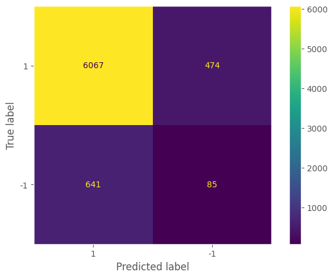
    


```python
df['LOF_anomaly'] = preds_iso_forest
plot_ts(df,anomalous_incidence,'Local Outlier Factor TSAD','LOF')
```


    
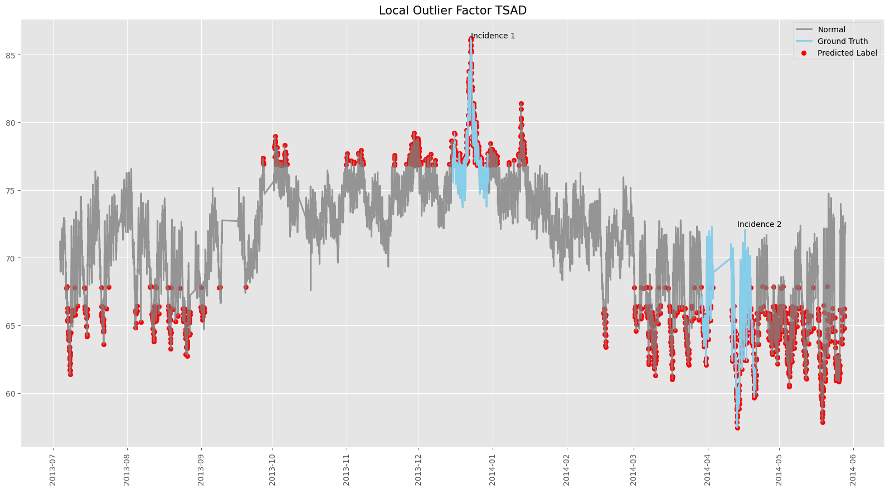
    


```python
return_metrics(df['anomaly'], preds_lof)
```

    Recall: 0.9275 F1: 0.9158 AUROC: 0.5223 Precision: 0.9044


    (0.9275340162054732,
     0.9158427051098197,
     0.5223069530063178,
     0.9044424567680381)


```python
from sklearn.metrics import cohen_kappa_score

cohen_kappa_score(df['anomaly'], preds_lof)
```


    0.0496951419392907


```python
lof_window = LocalOutlierFactor(n_neighbors=18,contamination=contamination, novelty=True)

lof.fit(window_data.mean(axis=1).reshape(-1,1))
```


    LocalOutlierFactor(contamination=0.0999, n_neighbors=18, novelty=True)


```python
preds_lof = lof.predict(window_data.mean(axis=1).reshape(-1,1))

cm = confusion_matrix(window_label, preds_lof, labels=[1, -1])

disp_cm = ConfusionMatrixDisplay(cm, display_labels=[1, -1])

disp_cm.plot();
plt.grid(False)
plt.tight_layout()
```


    
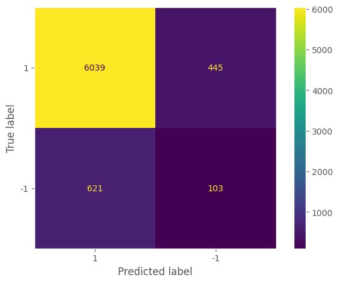
    


```python
return_metrics(window_label, preds_lof)
```

    Recall: 0.9314 F1: 0.9189 AUROC: 0.5368 Precision: 0.9068


    (0.9313695249845774,
     0.9188983566646377,
     0.5368173591773715,
     0.9067567567567567)


```python

```
